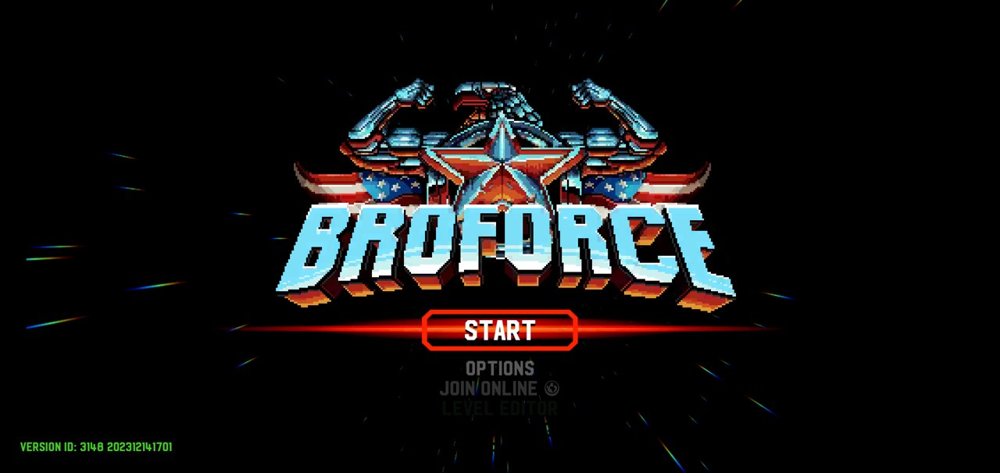
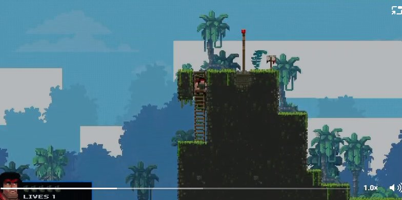

# BroforceAndroid

Unofficial port of **Broforce** (PC/Steam) to Android, played with a **gamepad**.

> **This repository contains no game files.** No assets, no DLLs, no decompiled code. It holds only documentation, scripts and patches. To use it you need **your own copy of Broforce on Steam**: the pipeline takes the files from your local install and builds an APK for personal use. Do not distribute generated APKs.
>
> Broforce is the property of Free Lives and Devolver Digital. This project is not affiliated with or endorsed by them.

## Scope

- **Gamepad only**: a physical controller, wired (USB-C) or Bluetooth. There are no on-screen controls.
- **Android ARMv7 (Mono)**: the game is Unity 2017.4 with the Mono backend, which only targets 32-bit ARM. Your device must support `armeabi-v7a`.
- No Steam: achievements, stats and online multiplayer are disabled.

To check whether your device is compatible:

```sh
adb shell getprop ro.product.cpu.abilist
# must include armeabi-v7a
```

## How it works

1. **Export**: [AssetRipper](https://github.com/AssetRipper/AssetRipper) turns your Broforce install into a Unity project.
2. **Patch**: scripts in this repo remove what doesn't exist on Android (Steamworks, console SDKs, Windows Forms) and fix saves, shaders and gamepad input.
3. **Build**: Unity 2017.4.7f1 produces the APK.

## Status: playable (v0.1.0)

<p>
  
  
</p>

**Arcade mode and the campaign are playable** on a Galaxy S23 (Android 16): smooth, with music, effects and voices. Tested with a keyboard so far; gamepad testing is next.

Since v0.1.0, on `main`: the background clouds and the 3D world map globe render correctly, and the game fills wide screens edge to edge, including the camera cutout. Next: gamepad testing on device. See the [v0.2.0 milestone](../../milestones).

How it got here, step by step and with screenshots: [docs/progress.md](docs/progress.md).

| Phase | Goal | Gate |
|---|---|---|
| 0 | Reconnaissance | Unity version, plugins and device ABI known ✅ |
| 1 | Export with AssetRipper | Project opens in the Editor with no compile errors ✅ |
| 2 | Run in the Editor | A full mission is playable on PC (skipped: tested on device directly) |
| 3 | First Android build | The game boots on the phone and reaches the main menu ✅ |
| 4 | Gamepad | A full mission on the phone with a controller |
| 5 | Performance and polish | Every world playable at a stable frame rate |

Technical notes are in [docs/](docs/).

## Getting started (development)

You need Windows, Broforce installed via Steam and [7-Zip](https://www.7-zip.org).

```powershell
./scripts/build-all.ps1   # everything below in one go (-Install to put it on the phone)
```

Or step by step:

```powershell
./scripts/setup-env.ps1   # Unity 2017.4.7f1 + Android module, JDK 8, legacy Android SDK
./scripts/export.ps1      # your Broforce install -> Unity project in export/ (git-ignored)
./scripts/patch.ps1       # apply the Android patches to the exported game DLLs (needs .NET SDK 8+)
./scripts/build-apk.ps1   # switch to Android, rebuild the asset bundles, build build/Broforce.apk
```

The full pipeline is explained in [docs/building.md](docs/building.md).

Optional: put your own `art/icon.png` (app icon) in the repo folder before `build-apk.ps1`. The `art/` folder is git-ignored; official art is never committed.

Unity 2017.4 also needs a free Personal license, activated once from the 2017.4 editor itself (not from the current Unity Hub). Details in [docs/setup.md](docs/setup.md).

## Contributing

Issues and PRs are welcome. Golden rule: **never commit game files** or code decompiled from the game. Changes to the game's code go in as patches or scripts applied on top of your local export.

Part of the planning and code was done with the help of AI tools.

## License

[MIT](LICENSE), covering only the original content of this repository.
