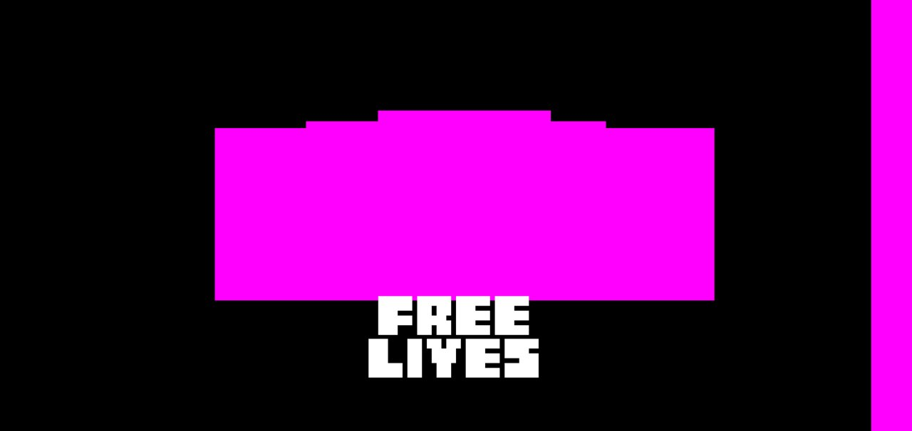
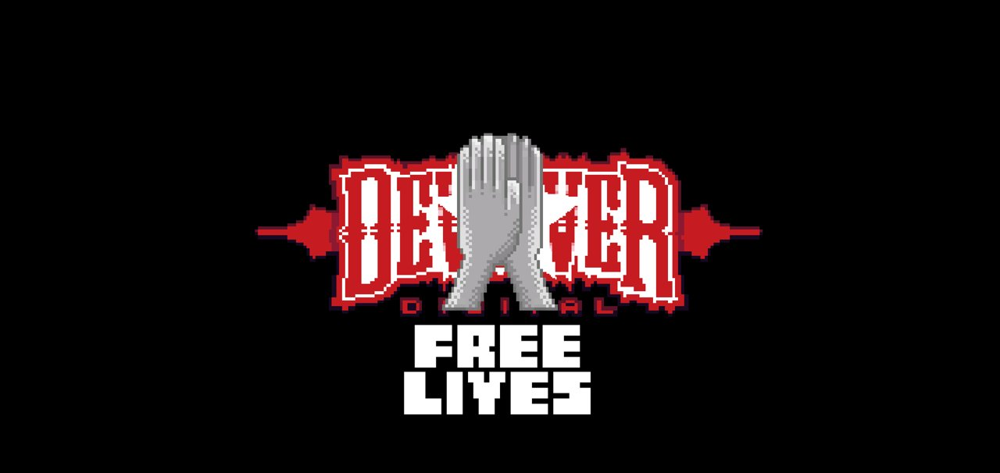
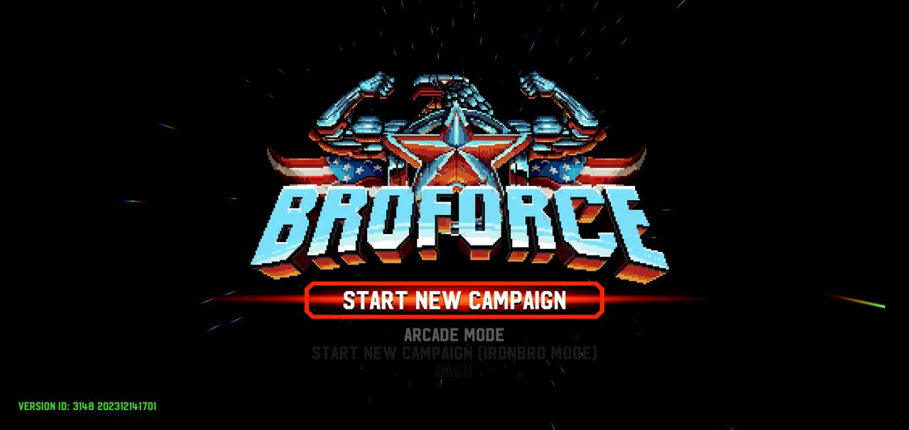
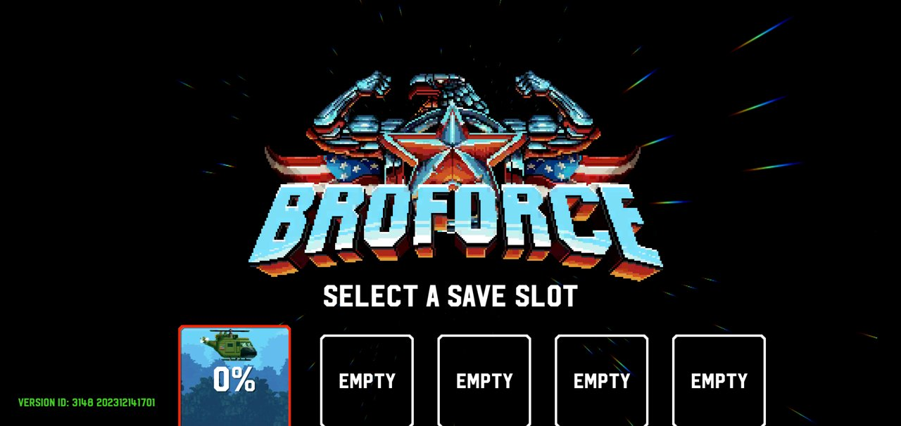
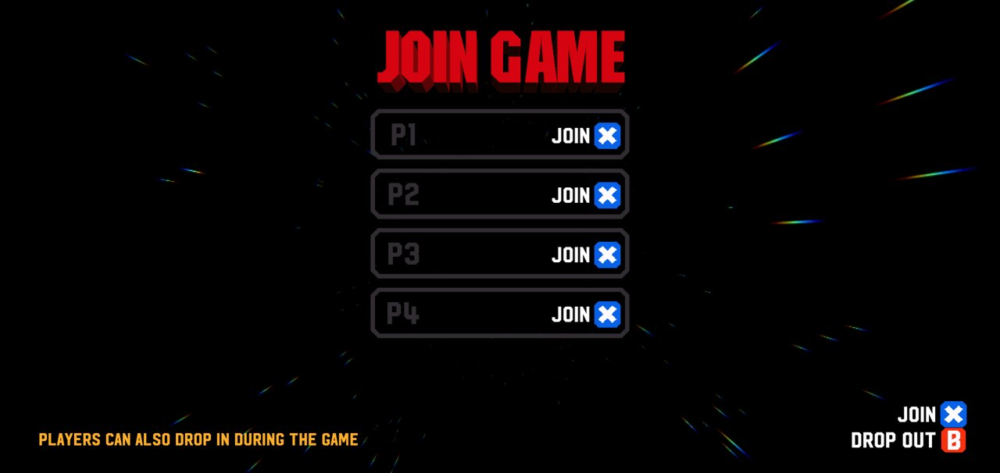
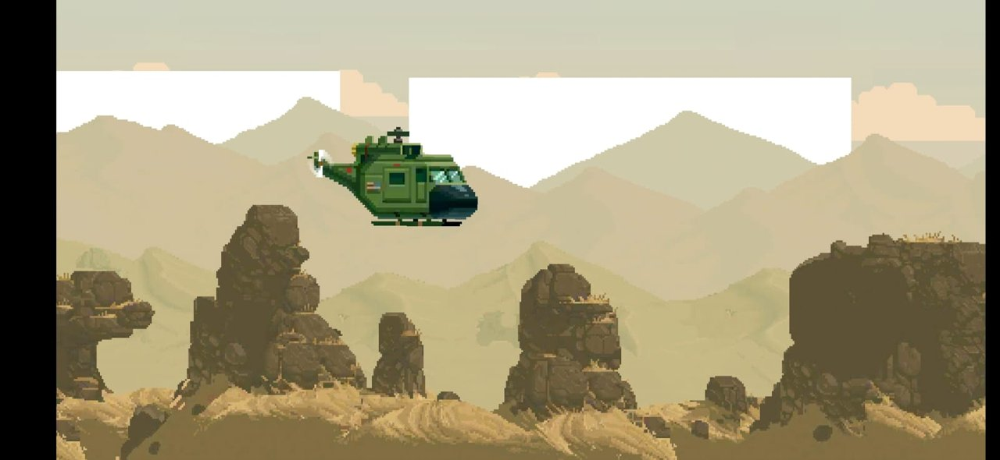
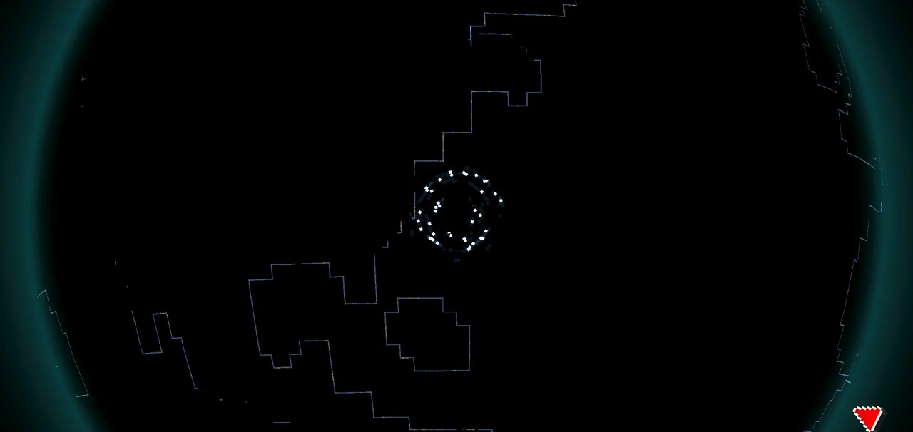

# Progress log

How the port got from "nothing" to "playable", with the screenshot that came out of each step. Screenshots are from an Android 11 x86_64 emulator (ARM translation, host GPU) unless marked **S23** (Galaxy S23, Android 16).

## v0.1.0: first playable build

### 1. First boot: something renders

The APK installs and Unity starts, but magenta means "shader not supported": the emulator was running OpenGL ES 2.0 and the build is GLES3-only. Everything else about the frame (the Free Lives logo in its place) was already right.

Getting here took:
- a signature-compatible replacement for Unity 2017's `JNIBridge`, because Android 16 added a default method to `ServiceConnection` that crashed the player 5 seconds after launch;
- renaming the game assemblies away from Unity's reserved `Assembly-CSharp*` names, without which every game script was a "missing script";
- using the game's original DLLs instead of AssetRipper's re-written ones, which broke Rewired (all input) with a `TypeLoadException`.

### 2. Intro

On GLES3 the Devolver / Free Lives intro renders with the rewritten shaders. The intro then hung on this frame: the `Fader` script was missing inside the rebuilt AssetBundles (an incremental bundle build kept scenes that pointed at the old assembly names). Bundles are now always fully rebuilt.

### 3. Main menu, black

The main menu scene loaded (a renderer dump showed the logo and menu items being drawn), but the frame came out black. The culprit was Amplify Color's color grading on the main camera, whose shaders are still placeholders. It's bypassed on Android.

### 4. Main menu

The main menu, fully rendered, with keyboard navigation working.

### 5. Menus and saves

Menus navigate with keys or a gamepad. Saves go to `Application.persistentDataPath`. Creating a campaign failed at first: the save thumbnail copied raw texture bytes from an ETC2 texture. It's now drawn through a RenderTexture.

### 6. Playing (S23)

Arcade mode and the campaign are playable on the Galaxy S23: smooth, with music, effects and voices.

### Known issues in v0.1.0

- **Background clouds render as white/grey rectangles** (S23): the cloud layer's transparency is lost.
- **The 3D world map globe is black** (emulator and S23); the campaign still works.

