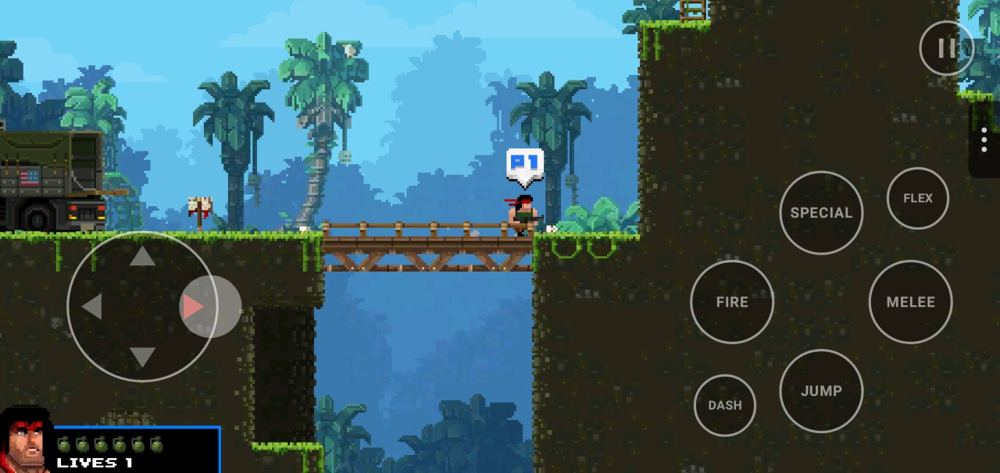
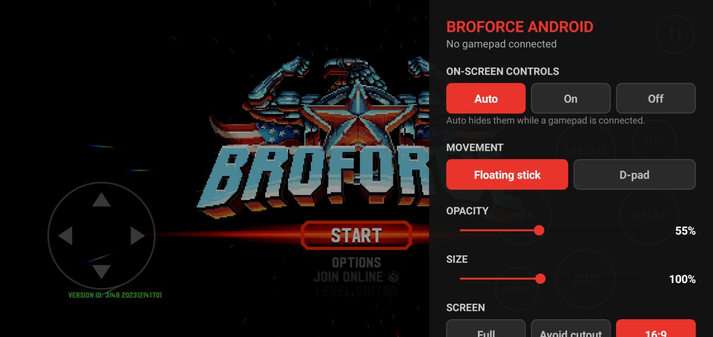

# On-screen controls and quick settings

Play with a gamepad, with the on-screen controls, or both. By default the on-screen controls show up while no gamepad is connected and hide when one is.

## Controls

| On screen | Game action | Key sent |
|---|---|---|
| Stick (left) | Move, climb, aim | Arrows |
| JUMP | Jump | Up |
| FIRE | Fire, confirm in menus | Z |
| SPECIAL | Special / grenade | X |
| MELEE | High five, melee, use | C |
| DASH | Dash | Left Shift |
| FLEX | Flex (gesture) | V |
| ❚❚ (top right) | Pause, back in menus | Esc |

- **Floating stick** (default): put your thumb anywhere on the left side of the screen and drag. The stick follows your thumb if it goes past the edge.
- **D-pad**: fixed in the bottom-left corner.
- Up on the stick also jumps: that's how the game's keyboard layout works. The stick only counts Up when you push nearly straight up, so diagonals don't jump by accident.
- A finger can slide from one button to another without lifting (Fire → Jump, for example).

## Quick settings

Drag the small **⋮** tab on the right edge to the left, or tap it.

| Setting | Options |
|---|---|
| On-screen controls | **Auto** (hidden while a gamepad is connected), On, Off |
| Movement | **Floating stick**, D-pad |
| Opacity | 20–100 % |
| Size | 60–150 % |
| Screen | **Full** (edge to edge, under the camera cutout), Avoid cutout, 16:9 (the game's original shape, centered) |
| Vibration | **On**, Off |

Settings are saved on the phone and survive updates.

## How it works

The overlay is a native Android layer (`android/src`) on top of the Unity view, started by `Hooks.OnStartup`. It doesn't touch the game: each on-screen control injects the key event of the game's default keyboard layout for player 1 (`PlayerOptions`), exactly as a hardware keyboard would. Keys are reference-counted, so the stick's Up and the JUMP button can overlap safely, and everything is released when the controls hide, the panel opens or the app loses focus.

`build-apk.ps1` compiles it (Java 7 bytecode, against `android.jar`) into `Assets/Plugins/Android/BroforceAndroid.jar`.

If you changed player 1's keys in the game's options, the on-screen controls won't match; reset the keyboard controls to the defaults.
